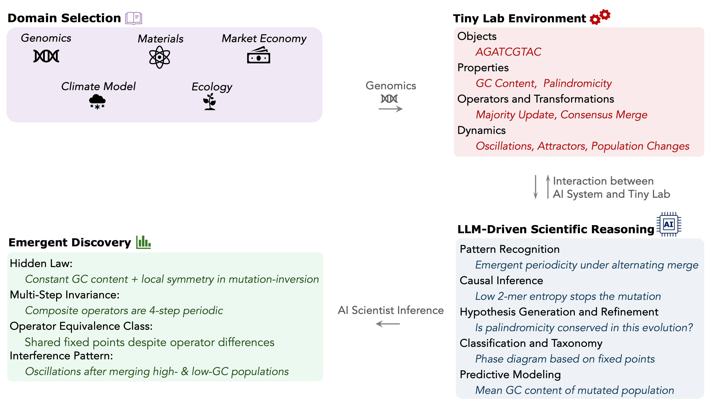

# Tiny Labs: A Lightweight, Interactive Benchmark for AI-Driven Scientific Discovery

Tiny Labs is an interactive benchmarking framework for evaluating and enhancing scientific reasoning in large language models (LLMs). Each Tiny Lab defines a set of objects, measurable properties, and operators that together give rise to complex, emergent behaviors. Tiny Labs can be instantiated across different scientific domains (see the [technical report](./Technical_Report.pdf) for details).

In this demo, we present a genomics Tiny Lab that models DNA sequences, mutations, and motif statistics. This “genomic lab” allows an LLM to propose experiments, analyze results, and infer underlying biologically inspired rules through three complementary demos.





## Technical Report

You can refer to the [full technical report](./Technical_Report.pdf) for a detailed explanation of the Tiny Labs framework, along with an analysis of the performance of various AI models across each of the challenges in the Genomics Tiny Lab environment.

## Repository Structure

* **`Properties.py`**
Interactive property discovery and inverse sampling demo. An LLM infers an unknown property of a short strand of a DNA-like string by sampling or proposing sequences across several rounds.

* **`Dynamics.py`**
  Dynamical system demo. The LLM runs experiments on a hidden DNA-sequence process by choosing inputs, measuring properties over time, and reporting its hypotheses about the underlying dynamics.

* **`Evolution.py`**
LLM-guided sequence evolution framework. Models attractor dynamics in property space and enables the LLM to discover convergence behavior by evolving sequences toward fixed points.

## Requirements

Install dependencies:

```bash
pip install numpy scipy openai
```

Set your OpenAI API key in the environment:

```bash
export OPENAI_API_KEY="sk-..."
```


## Usage

You can run ``` Properties.py```, ```Dynamics.py``` or ```Evolution.py```. Edit the constants at the top of each script to customize the sequence length, model name, randomness, and more.